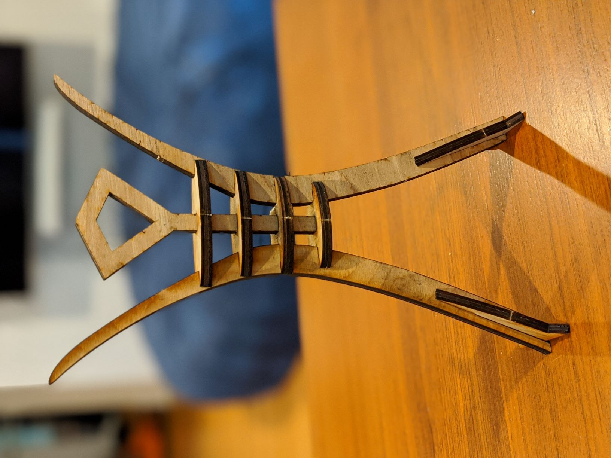
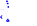

# Burn @ Home

Burn at home is a miniature burning man effigy designed to be laser cut and burned at home.

You can find assembly instructions [here](http://burnathome.projects.land)

## Requirements

It is tweaked to be cut from [1/5 in. Hardwood Plywood Underlayment Specialty Panel](
https://www.homedepot.com/p/1-5-in-x-4-ft-x-8-ft-Hardwood-Plywood-Underlayment-Specialty-Panel-431178/203183010) or [Underlayment (Common: 3/16 in. x 2 ft. x 4 ft.; Actual: 0.189 in. x 23.75 in. x 47.75 in.)](https://www.homedepot.com/p/Underlayment-Common-5-0-mm-x-2-ft-x-4-ft-Actual-0-189-in-x-23-75-in-x-47-75-in-445789/202093874) which measured as 0.191" on the panel I used.

The SVG files provided have been tested on a Glowforge cutter.  The blue lines are intended to be cut, the green scored, and the red cut, in that order.

## Cutting a Kit

If you'd like to cut out a break kit that can be broken apart and assembled as a gift, you'll want to use [burnathome_kit_cutout.svg](burnathome_kit_cutout.svg). It has small tabs on each piece and an outline cutout.

## Cutting just the pieces

If you would just like to cut out the pieces directly, use [burnathome_cutout.svg](burnathome_cutout.svg) instead.

## Tweaking the model

The original source model from Fusion 360 has also been provided if you need to make tweaks.  There are user parameters defined in the sketch for things like the stock material thickness.