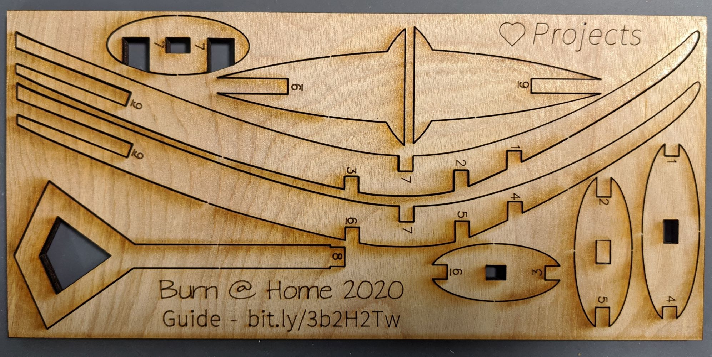

<!-- ## Burn at Home! -->
We may not be on the playa, but the man can't still burn.  Here's how to assemble your burn @ home man!

### Step 1: Break apart pieces
Gently twist each piece until it pops out, starting with the smaller pieces.

If you're having difficulty removing some pieces, double check they are cut all the way through.  If not, it may be possible to use a blade to finish the cuts from the back side.

### Step 2: Attach ribs (1-6)
Start by attaching the ribs marked 1, 2, and 3 to corresponding spots of one of the side arches. 

With all three ribs attached, attach the opposite side arch (4, 5, and 6).  If you feel like you have to force it into place, check to make sure all of the cutouts are properly lined up.

### Step 3: Attach locking rib (7)
From the front, attach rib 7 to it's marked position.

### Step 4: Attach head (8)
Insert the head into the top slot and push down until it goes through all of the ribs, locking them in place.  It may take a little pressing for it to go all of the way down.

### Step 5: Add leg supports (9)
Finally, attach the leg supports to the body.

